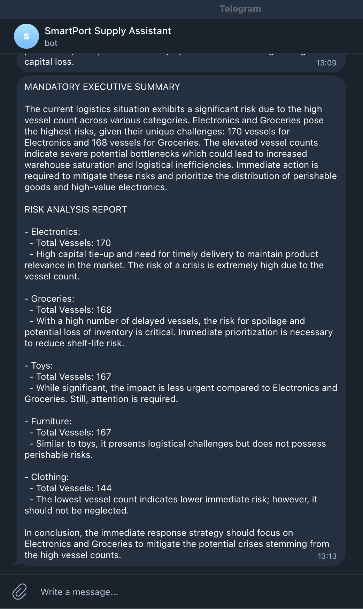

# SmartPort Supply Chain Bridge 🚢📦

This project integrates maritime logistics data with warehouse inventory predictions. It serves as an automated decision-support system for supply chain managers.

## 🔗 Project Integration
This repository acts as the central intelligence hub for:
1. **[SmartPort AI Risk Warning](https://github.com/robertofernandezmartinez/smartport-ai-risk-early-warning):** Real-time maritime delay predictions and alerts.
2. **[Retail Stockout Risk Scoring](https://github.com/robertofernandezmartinez/retail-stockout-risk-scoring):** Inventory depletion forecasts.

## Technical Assumption: Logistics Scaling for Cross-System Integration
In this integrated project, we make a deliberate distinction between the "Critical" status in the **SmartPort AI** module and the **Supply Chain Bridge** module:

- **Original SmartPort Context**: In the real-time monitoring module, a "Critical" status typically refers to a tactical delay (120+ minutes) in port docking operations.
- **Bridge Engine Assumption**: To make the inventory cross-reference meaningful, the Bridge interprets a "Critical" Maritime Risk as a major logistical disruption representing a **7 to 14-day delay**.

**Why this assumption is necessary**: A 2-hour delay is operationally relevant for port staff but irrelevant for a 14-day retail stockout prediction. By scaling the interpretation of "Critical" to represent a multi-day disruption, the system can realistically simulate the Lead Time Gap: the period where local inventory is depleted before the delayed shipment can complete the **Customs + Last-Mile Distribution cycle**, usually an additional 5-day buffer.

This logic transforms the bot from a simple notification tool into a **Strategic Risk Predictor**, identifying disruptions that actually threaten business revenue.

## 🧠 The Intelligence Logic
1. **Maritime Input:** Monitors vessel delays and risk scores from the SmartPort AI project.
2. **Bridge Mapping:** Automatically links incoming vessels to specific product categories (e.g., Electronics, Toys).
3. **Inventory Impact:** Cross-references impacted categories with stockout predictions (14-day forecast).
4. **AI Notification:** If a delay risks a stockout, **GPT-4o-mini** generates a professional executive alert sent via **Telegram**.

## 🛠️ Tech Stack
- **Python:** Data orchestration with Pandas.
- **Google Sheets API:** Real-time data source.
- **OpenAI API:** Generative AI for logistics insights.
- **Telegram Bot API:** Automated communication channel.